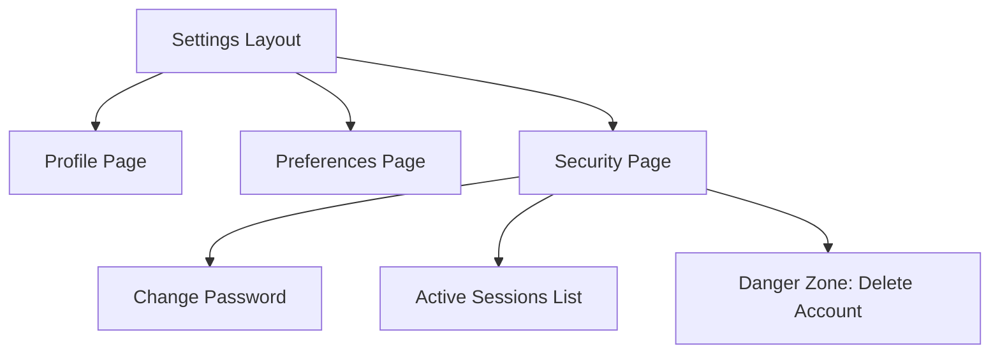

# RFC: Settings & Profile Page and Responsive Layout Strategy

This Request for Comments (RFC) outlines the technical implementation strategy and design guidelines for the **Settings & Profile Page** and the general **Responsive Layout Strategy** for the Next.js web application. As the platform transitions to support rich user configurations, localized multi-language rendering (particularly Indic scripts), and complex responsive interfaces (such as split-screen editors and drawers), establishing clean frontend paradigms is crucial. This document acts as a blueprint to guide the team in building consistent, accessible, and performant user interfaces without introducing fragmentation or layout regression.

---

## Overview

The settings and profile management workflow represents the primary portal for user configuration, personalization, and security operations. Providing a robust, high-performance, and visually intuitive interface directly correlates with user retention and platform security trust. 

At the same time, the responsive design strategy must accommodate diverse viewport requirements, including:
- Desktop viewports designed for dense data management and multi-pane editing workflows.
- Tablet viewports requiring dynamic layout adjustments and collapsible panels.
- Mobile viewports optimized for single-pane focus, high touch-target visibility, and gesture-driven overlays.

Establishing these layouts requires careful coordination of routing patterns, state management, security boundaries (using Supabase Auth), and specific linguistic needs (such as line-height and layout expansion metrics for Indic scripts).

---

## Scope

- **In-Scope**:
  - Routing layout and page design for `/settings`, `/settings/profile`, `/settings/preferences`, and `/settings/security` using Next.js App Router conventions.
  - Form state management, validation guidelines, and interactive UI controls for user profile details, language options, notifications, and account actions.
  - Detailed integration blueprints for Supabase Auth on the client and middleware (session handling, user retrieval, profile metadata updates, security resets, global sign-out, and account deletion flows).
  - Screen breakpoints and responsive layout behaviors for main layouts (Dashboard, split-screen Editor, mobile navigation, and drawers).
  - Special typographic and layout adjustments for Indic scripts (such as line heights, character spacing, font scaling, and overflow preservation).
  - Accessibility constraints (WCAG 2.1 AA compliant keyboard navigation, ARIA tagging, focus traps).
  - Recommended Next.js and Tailwind project folder layout within `apps/web`.
- **Out-of-Scope**:
  - Backend schema changes, database migrations, or trigger definitions inside Supabase.
  - Serverless function code or remote API implementations (e.g., setting up the actual SMTP servers for verification).
  - Writing or deploying production components, CSS configurations, or package configurations (package.json edits).

---

## Existing Structure

The current frontend application in `apps/web` follows the Next.js App Router layout:
- **`apps/web/app/`**: Root route directories.
  - **`dashboard/`**: Contains dashboard layout and views.
  - **`sign-in/`**: Contains authentication components and logic.
  - **`layout.tsx` & `page.tsx`**: Global wrapper layout and index homepage.
- **`apps/web/components/`**: Reusable React components.
  - **`ui/`**: shadcn/ui components (currently contains `button.tsx`).
- **`apps/web/lib/`**: Common utility files.
  - **`utils.ts`**: Tailwind CSS class merges (`cn` utility wrapper).

---

## 1. Settings & Profile Page

### Proposed Routes

We propose nesting the settings routes under a dynamic route directory inside `apps/web/app/settings`. This provides a consistent route structure while allowing a shared layout.

```
app/
└── settings/
    ├── layout.tsx         # Shared layout (sidebar navigation + page frame)
    ├── page.tsx           # Redirects to /settings/profile
    ├── profile/
    │   └── page.tsx       # Account & profile details form
    ├── preferences/
    │   └── page.tsx       # Language & notification preferences
    └── security/
        └── page.tsx       # Password, active sessions, danger zone
```

**Why this structure is chosen:**
1. **Shared Layout Pattern:** The `settings/layout.tsx` acts as a wrapper. It renders a persistent vertical sidebar on desktop and a horizontal tab navigation on mobile, enabling smooth client-side navigation between subsections without re-rendering the whole page layout.
2. **Clear Separation of Concerns:** Separating forms onto individual sub-routes (profile, preferences, security) makes each view lightweight. This improves form performance, limits unnecessary state re-renders, and simplifies validation schemas.
3. **Targeted Security Actions:** The `/settings/security` page handles high-risk interactions (e.g., password change, global log-out, account deletion). Grouping these items onto a separate page simplifies the implementation of "re-authentication" patterns or security steps.

---

### Settings Sections

#### Account Info (`/settings/profile`)
- **Profile Picture/Avatar:** Drag-and-drop or file upload zone with instant image preview, size validation, and integration with Supabase Storage.
- **Full Name & Username:** Text inputs with character length and alphanumeric validation.
- **Primary/Secondary Email:** Display of authenticated email. Includes status indicator (Verified/Pending) and a trigger to change/re-verify emails.
- **Phone Number:** Internationalized input format with validation.

#### Preferences (`/settings/preferences`)
- **Language Selection:** Dropdown selector to toggle app locales (e.g., English, Hindi, Tamil, Bengali). Modifies context-based localization settings.
- **Theme Selection:** System default, Light, and Dark modes.
- **Notification Preferences:** Toggle switches (utilizing shadcn `Switch` component) to manage:
  - Email Digests (daily, weekly, none).
  - Activity Notifications (updates on document edits, comments, reminders).
  - Security Alerts (sign-in notifications, key configuration changes).

#### Security & Sessions (`/settings/security`)
- **Password Actions:** Secure fields for current password, new password, and password confirmation with real-time strength indicators.
- **Active Devices/Sessions:** A list detailing currently active sessions:
  - Session details: IP address, location, browser, OS, and "Last active" time.
  - "Revoke Session" buttons next to individual items.
  - "Sign Out of All Devices" option to end all active sessions globally.
- **Danger Zone:** A visually distinct section (red border, warning alert) containing:
  - Account deletion option.
  - Clear explanations of data loss risks.
  - Multi-step validation to proceed.



---

### Supabase Auth Interactions

#### Session Handling & Auth Guards
Authentication state will be handled using Supabase Auth helpers or the `@supabase/ssr` package.
1. **Middleware Check:** The Next.js middleware (`middleware.ts`) intercepting `/settings/*` and `/dashboard/*` handles routing checks. If no valid session is found (determined via standard cookie checks), the request is redirected to `/sign-in`.
2. **Client-Side Refresh:** The frontend client will establish a subscription listener to handle token expiration/renewal:
   ```typescript
   const { data: { subscription } } = supabase.auth.onAuthStateChange((event, session) => {
     if (event === 'SIGNED_OUT') {
       router.push('/sign-in');
       router.refresh();
     }
   });
   ```

#### Fetching Authenticated User
- Server Components inside `/settings/*` will fetch user details using a secure server-side client:
  ```typescript
  const { data: { user } } = await supabase.auth.getUser();
  ```
  `getUser()` is preferred over `getSession()` in server routing context to prevent cookie tampering risks.

#### Updating Profile Metadata
- Profile information updates can be stored inside Supabase user metadata:
  ```typescript
  const { data, error } = await supabase.auth.updateUser({
    data: { displayName: "New Name", avatarUrl: "https://..." }
  });
  ```
- If custom user databases exist, the frontend will execute an update mutation against the user profile table in PostgreSQL, linking via the user's uuid (`auth.uid()`).

#### Sign Out of All Devices
- To revoke authorization tokens across all active devices:
  ```typescript
  const { error } = await supabase.auth.signOut({ scope: 'global' });
  ```
- This triggers session termination in the browser, clears cookies, and redirects the user to `/sign-in`.

#### Delete Account Flow
1. **Security Guard:** User is prompted to re-enter their password to verify identity.
2. **Trigger:** The client calls a secure RPC or Edge Function endpoint with the authenticated headers to process account deletion, since client-side SDKs do not permit direct deletion to prevent administrative abuse.
3. **Database Cascade:** On successful backend account deletion, the public schema triggers will handle cleaning up database records, and the client client clears its state, logging the user out.

---

### UI/UX Considerations

- **Optimistic Updates:** For actions like switching language preferences or updating profile name, the UI should immediately display the new values while executing requests in the background. If the request fails, the application rolls back to the previous state and triggers a red toast alert.
- **Skeleton Loaders:** Settings screens require detailed placeholders during initial data retrieval, replacing flash-of-unstyled-text with structured skeletons.
- **Focus Management & Access:** Settings forms must support keyboard-only traversal (proper tab ordering, distinct focus halos) and screen reader alerts for live changes.
- **Touch-Friendly Controls:** Small items (like switches, links, and buttons) will have active hit targets of at least 44x44 pixels.

---

## 2. Responsive Layout Strategy

### Breakpoints

We will follow standard Tailwind responsive design, leveraging mobile-first definitions. Custom layouts will map directly to these screen widths:

| Breakpoint Name | Tailwind Prefix | Min Width | Target Viewport |
| :--- | :--- | :--- | :--- |
| Mobile | (default) | `< 640px` | Phones (Portrait/Landscape) |
| Small Tablet | `sm` | `640px` | Large Phones / Small Tablets |
| Large Tablet | `md` | `768px` | Medium Tablets / Small Laptops |
| Small Desktop | `lg` | `1024px` | Standard Laptops / Large Tablets |
| Large Desktop | `xl` | `1280px` | Desktop Monitors |
| Ultrawide | `2xl` | `1536px` | Large Desktop Monitors |

All responsive style rules are applied using mobile-first constraints (e.g., `w-full lg:w-64` sets width to 100% on mobile and tablet, scaling to 256px on standard desktop sizes).

---

### Layout Rules

#### Main Dashboard Layout
- **Desktop:** Multi-pane screen layout. Collapsible left-hand navigation sidebar (`240px` - `280px`), top header for actions, and a main content viewport using dynamic grids.
- **Mobile/Tablet:** The sidebar collapses completely into a hamburger menu button. The content area scales to 100% viewport width with a minimal top toolbar or a bottom tab bar.

#### Document Editor
- **Desktop:** Split-screen layout. Main editing workspace occupies the left 60-70% of screen width; supporting document options or drawers occupy the right 30-40%.
- **Mobile:** Single pane layout. The user toggles between the editing workspace and options views using flat tabs or overlay buttons. Collapsible toolbars collapse into a drawer at the bottom of the screen.

#### Citation Drawer
- **Desktop:** Sliding panel anchored to the right viewport boundary (`w-[400px]`), sliding content into view without obscuring central text.
- **Mobile:** Modal bottom sheet (`h-[65vh] w-full`) sliding up from the bottom boundary. It uses the `vaul` drawer library to support sliding close gestures.

#### Tables, Cards, & Forms
- **Desktop:** Multi-column grids (`grid-cols-2` or `grid-cols-3`) for form panels, and standard data tables.
- **Mobile:** Data tables convert to scrollable lists of individual card components. Forms collapse to a single column vertical stack (`grid-cols-1`).

```
Desktop Layout:
┌─────────────────┬───────────────────────────────┬────────────────┐
│ Sidebar (w-64)  │ Main Editing Area             │ Drawer (w-96)  │
└─────────────────┴───────────────────────────────┴────────────────┘

Mobile Layout:
┌──────────────────────────────────────────────────────────────────┐
│ Navbar (hamburger)                                               │
├──────────────────────────────────────────────────────────────────┤
│ Main Editing Area (100% width)                                   │
├──────────────────────────────────────────────────────────────────┤
│ Bottom Citation Sheet / Drawer (Slides up from bottom)           │
└──────────────────────────────────────────────────────────────────┘
```

---

### Indic Script Considerations

Supporting Indic scripts (Devanagari, Tamil, Bengali, Telugu, etc.) requires specialized responsive layout and typography parameters.

1. **Vertically Accommodating Line-Heights:**
   - **Problem:** Indic letters contain complex conjunct letters and diacritics (matras) that extend above and below the baseline. Standard line heights (e.g., `leading-tight` or default spacing) will cause ascenders and descenders to overlap adjacent lines or clip boundaries.
   - **Solution:** Increase default line height to `leading-relaxed` (1.625) or `leading-loose` (2.0) for Indic text elements.
2. **Font Scalability & Readability:**
   - **Problem:** Small font sizes (under 14px) make Indic scripts illegible due to complex loops and characters.
   - **Solution:** Set the minimum font size for Indic text to `text-base` (16px) on mobile and `text-lg` (18px) on larger viewports. Do not use small captions (`text-xs`) for Indic scripts.
3. **Preserving Vowels in Layout Overflow:**
   - **Problem:** Relying on simple text truncation (`truncate` or `ellipsis`) can slice away critical vowel symbols above or below the base letters, changing the meaning of words.
   - **Solution:** Avoid `truncate` for Indic text blocks. Instead, use `line-clamp-N` or `break-words` to ensure complete line wrapping without vowel loss.
4. **Spacing Buffer:**
   - Add extra vertical padding (e.g., `py-2` instead of `py-1` on labels and input fields) to prevent script ascenders from clipping against input box borders.
5. **Localization Expansion Buffer:**
   - Translating from English to Indic languages typically increases text length by 30-50%. All design elements (buttons, sidebar navigation options, tabs) must avoid static width constraints (`w-[120px]`). Instead, use fluid sizing (`min-w-[120px] w-auto`) with flex layout wrapping.

---

### Component Responsiveness Rules

#### Modals vs. Drawers
- **Large Viewports (`>= md`):** Display as a centered overlay `Dialog` card with a dark backdrop.
- **Small Viewports (`< md`):** Display as a bottom sheet `Drawer` (`vaul`), which occupies less cognitive space, is thumb-reachable, and supports intuitive drag-to-dismiss behavior.

#### Buttons & Typography
- **Desktop:** Compact sizes, right or left-aligned actions (`w-auto md:w-fit`).
- **Mobile:** Full-width buttons (`w-full`) for CTA primary actions, offering bigger click targets. Font sizes scale down to prevent viewport overflow (`text-2xl md:text-3xl`).

---

## Accessibility (A11y)

- **Keyboard Traversal:** Focus traps (such as Radix/shadcn standard implementations) on modals, menus, and drawers must restrict focus to the interactive pane when active.
- **ARIA Labeling:** Interactive controls must have descriptive names (e.g., `<button aria-label="Toggle navigation drawer">`). Elements dynamically updated by forms should have `aria-live="polite"` tags.
- **Contrast Ratios:** Ensure text and background ratios meet WCAG 2.1 AA requirements (minimum 4.5:1 ratio for normal text, 3:1 for large text).
- **Indic Script Support:** Set the HTML `lang` attribute dynamically (`lang="hi"`, `lang="ta"`) based on locale selection to allow screen readers to use the correct language synthesis engine.

---

## Risks & Open Questions

1. **Supabase Direct Deletion Restrictions:** Supabase client SDK does not allow users to delete their own auth record directly. A custom backend service or Edge Function must handle validation and call the service role.
2. **Indic Web Font Delivery:** Loading multiple heavy Indic web fonts (which are much larger than Latin equivalents due to the large glyph inventory) can cause high latency or Flash of Unstyled Text (FOUT). We need to study the performance impact of font-subsetting.
3. **Optimistic Syncing:** Form changes on mobile could lag behind server state under slow mobile connections. We need to define standard timeout and rollback limits.

---

## Recommended Folder Structure

For our frontend codebase inside `apps/web`:

```
apps/web/
├── docs/
│   └── RFC-settings-profile-responsive-layout.md  # (This RFC document)
├── app/
│   ├── layout.tsx
│   ├── page.tsx
│   ├── dashboard/
│   │   └── page.tsx
│   ├── sign-in/
│   │   └── page.tsx
│   └── settings/
│       ├── layout.tsx
│       ├── page.tsx
│       ├── profile/
│       │   └── page.tsx
│       ├── preferences/
│       │   └── page.tsx
│       └── security/
│           └── page.tsx
├── components/
│   ├── ui/
│   │   ├── button.tsx
│   │   ├── dialog.tsx
│   │   ├── drawer.tsx
│   │   ├── switch.tsx
│   │   ├── input.tsx
│   │   └── select.tsx
│   └── settings/
│       ├── profile-form.tsx
│       ├── preference-form.tsx
│       └── security-form.tsx
└── lib/
    ├── utils.ts
    └── supabase/
        ├── client.ts
        ├── server.ts
        └── middleware.ts
```

---

## Future Improvements

1. **Multi-Factor Authentication (MFA):** Integrating TOTP authenticator setups inside the Security settings route.
2. **Dynamic Script Transliteration:** Incorporating options for users to view Indic text either in local script or transliterated Latin script.
3. **Settings Offline Cache:** Storing general visual preferences in local storage to instantly apply user themes before fetching authenticated Supabase data.

---

## Conclusion

This RFC establishes clear guidelines for implementing settings pages and responsive viewports for the frontend web application. By adhering to Next.js routing patterns, detailing Supabase Client workflows, designing for fluid layouts, and establishing specialized typography rules for Indic scripts, we will ensure a highly functional and accessible experience for all users on any device.
