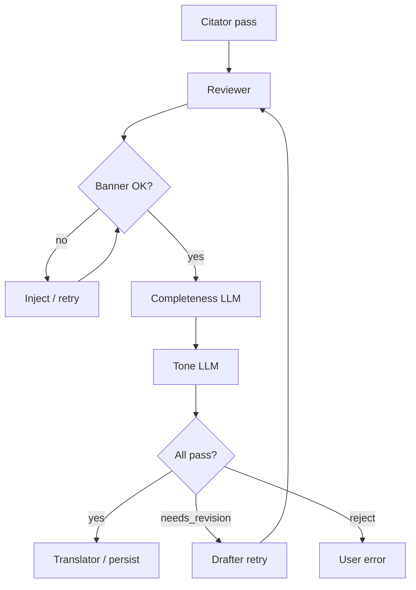

# RFC: Reviewer agent (completeness + tone)

**Issue:** [#15](https://github.com/Trionic-Interns/trionic-ai-adalat/issues/15)  
**Author:** Evan Gregor (@EvanGregor) · **Team:** Agents (Team C)  
**Status:** Draft (Week 1)  
**Week 1 deliverable:** This RFC only — implementation lands in `packages/agents/src/reviewer/` from Week 2 onward.  
**Reviewers:** Malay Sheta (agents lead), Hitarth Sherathia (Citator), Kaushal Vora (completeness evals), Dhruv Lokadiya / Sohil Kareliya (repo managers)  
**Escalation (stuck / scope):** Team lead @malaysheta · Repo managers @Dhruv5353 / @Sohil2085

---

## Context

### Problem

After the Drafter produces a grounded draft and the **Citator-gatekeeper** has verified citation markers, we still need a quality gate before the draft reaches the user (and optional **Translator**). Generic LLM drafts often:

- Omit mandatory sections for a document type (e.g. RTI missing the information-sought block).
- Use casual or advisory language (“you should sue them”) instead of neutral drafting tone.
- Ship without the legally required **“not legal advice”** disclaimer.

The **Reviewer agent** is the last automated editorial step in the English drafting pipeline. It does **not** replace lawyers or users; it ensures outputs are structurally complete, appropriately toned, and compliant with product constraints.

### Placement in the pipeline

```
Classifier → Planner → PageIndex → Drafter → Citator-gatekeeper → Reviewer → Translator? → persist
```

| Stage | Responsibility |
|-------|----------------|
| **Citator-gatekeeper** (Hitarth) | **Citation-or-die** in code: every legal-claim span must resolve to a valid `PageIndexNodeId`. Rejects ungrounded text. |
| **Reviewer** (this RFC) | **Completeness** vs doc-type template, **tone** (formal/professional, non-advisory), **banner** presence (deterministic). |
| **Translator** (Maharshi) | Indic round-trip after English draft is accepted; must preserve banner + structure. |

### Non-goals (Reviewer v1)

- Re-validating whether `[CITE:<node_id>]` markers exist or resolve (Citator + eval harness own this).
- Legal correctness (“is Section 73 applicable?”) — out of scope; user + counsel decide.
- Case-law retrieval or new citations — Reviewer must not invent nodes or strip Citator-approved markers.
- Replacing the redline editor — user still edits before export.

### Related work

| Owner | Artifact | Dependency |
|-------|----------|------------|
| Malay Sheta | Planner agent | Supplies `DocType` + `DocTypeTemplate` (required sections). |
| Jenil Sutariya | Drafter agent | Produces draft markdown + `[CITE:…]` markers. |
| Hitarth Sherathia | Citator-gatekeeper | Must run **before** Reviewer; see `docs/RFC-citator-gatekeeper.md` (when published). |
| Kaushal Vora | Completeness eval | Consumes Reviewer checklist JSON for fixtures. |
| Team B | Templates table / API | Persistent templates (Week 4); Week 1–3 use in-memory fixtures from `packages/shared`. |

> **Note on PROJECT_BRIEF G5:** G5 states “Reviewer agent rejects un-grounded claims.” For implementation, **citation validity is enforced only by the Citator-gatekeeper** (`packages/agents/README.md`). The Reviewer may **reject drafts that read like legal advice** or fail template completeness, but must **not** bypass or weaken Citator. If Reviewer and Citator disagree, Citator wins on citations.

---

## Proposal

### Responsibilities

The Reviewer runs as an **Agno agent** (Team C) invoked by the agent orchestrator after a successful Citator pass. It performs three checks:

1. **Banner check (deterministic, no LLM)**  
   Verify the canonical disclaimer appears verbatim (or matches a approved pattern) in the draft body or mandated header block.

2. **Completeness check (LLM + structured schema)**  
   Compare the draft against the **Planner-selected `DocTypeTemplate`**: required sections, minimum fields, and doc-type-specific boilerplate (e.g. RTI applicant address block).

3. **Tone check (LLM + rubric)**  
   Score/register check: formal, professional, third-person/neutral where appropriate; flag imperative advice (“you must file within X days” without citation), threats, or guarantees of outcome.

### Outcomes

| Result | Meaning | Next step |
|--------|---------|-----------|
| `pass` | All checks satisfied | Proceed to Translator (if needed) → persist |
| `needs_revision` | Fixable gaps (missing section, tone tweak) | Return structured feedback to **Drafter** (max retries, see below) |
| `reject` | Hard failure (banner missing after retry, abusive content, wrong doc type) | Stop pipeline; surface error to API/UI |

### Retry policy

- **Max 2** Drafter revision loops driven by Reviewer feedback (configurable via env `REVIEWER_MAX_REVISIONS`).
- Banner failures on first pass trigger **one** automatic re-insertion via template helper (code path), then re-run deterministic check before calling LLM.
- After max retries, status `reject` with `AgentTrace.status = "rejected"` and user-visible message.

### Canonical “not legal advice” banner

Stored in `packages/shared` as `LEGAL_DISCLAIMER_BANNER` (exact string TBD with repo managers; example below).

```text
---
**AI-generated draft — not legal advice.** This document was produced by Trionic Adalat to assist with drafting only. It is not a substitute for advice from a qualified legal professional. Verify all citations and facts before use.
---
```

**Banner check rules (code, not LLM):**

- Normalized whitespace-insensitive match of the bold lead-in: `AI-generated draft — not legal advice`.
- Must appear in the first **2 000** characters of the draft **or** in a dedicated `disclaimer` section if the template defines one.
- Export layer (Team B) re-injects banner if missing — Reviewer still **fails** the draft so we never rely on export-only fixes silently.

### Document types (v1)

Aligned with `PROJECT_BRIEF.md` G2:

| `DocType` | Required sections (high level) |
|-----------|--------------------------------|
| `rti_application` | Header; applicant details; public authority; information sought; fee/exemption; signature block; banner |
| `legal_notice` | Parties; cause of action summary; demand/relief; timeline; governing law reference (cited); banner |
| `nda` | Parties; definitions; confidential information; obligations; term; governing law; signatures; banner |
| `consumer_complaint` | Complainant; opposite party; transaction facts; deficiency; relief sought; jurisdiction; banner |
| `employment_contract` | Parties; role; compensation; term; termination; confidentiality; governing law; banner |

Detailed per-section prompts and field keys live in `DocTypeTemplate` (Planner output). Reviewer receives the **same template instance** the Planner passed to the Drafter.

### Tone rubric (LLM)

**Pass** when all are true:

- Register is formal/professional (no slang, no emoji).
- No first-person guarantees (“I guarantee…”, “We will win…”).
- Recommendations phrased as conditional or factual (“The Act provides that…”) with citations where asserting law.
- No explicit “you should hire a lawyer / sue / break the law” — use neutral “you may wish to consult…” only in optional footer, not body.

**Fail** examples:

- “Don’t worry, this notice will definitely get you a refund.”
- “Ignore the RTI timeline rules.”
- Casual: “Hey, just send this to the court lol.”

### High-level flow

```text
Input: ReviewerInput (draft + template + traces)
  │
  ├─► checkBanner(draft) ──fail──► tryInjectBanner() once ──fail──► reject
  │
  ├─► checkCompleteness(draft, template) ──LLM──► CompletenessReport
  │
  ├─► checkTone(draft, docType) ──LLM──► ToneReport
  │
  └─► aggregate → ReviewerResult (pass | needs_revision | reject)
```



---

## API / contracts

Types below are proposed for `packages/shared` (subject to repo-manager review). Implementation lives in `packages/agents/src/reviewer/` (Week 2+).

### Types

```ts
/** Mirrors Planner output — owned by Planner RFC; Reviewer consumes read-only. */
export type DocType =
  | "rti_application"
  | "legal_notice"
  | "nda"
  | "consumer_complaint"
  | "employment_contract";

export interface DocTypeTemplateSection {
  id: string; // stable key, e.g. "information_sought"
  title: string;
  required: boolean;
  /** Hint for Drafter/Reviewer; not shown to end user verbatim */
  description?: string;
}

export interface DocTypeTemplate {
  doc_type: DocType;
  version: string; // e.g. "2026-05-17"
  sections: DocTypeTemplateSection[];
}

export interface ReviewerInput {
  /** Draft markdown after Citator pass (markers intact). */
  draft_markdown: string;
  doc_type: DocType;
  template: DocTypeTemplate;
  /** Original user intake for context (redacted per PII policy). */
  intake_summary: string;
  /** Prior agent traces for this request (Classifier, Planner, Drafter, Citator). */
  prior_traces: AgentTrace[];
  locale: "en" | "hi" | "gu" | "mr" | "ta"; // Reviewer v1 runs on English draft only
}

export interface SectionCheck {
  section_id: string;
  present: boolean;
  notes?: string;
}

export interface CompletenessReport {
  sections: SectionCheck[];
  missing_required: string[];
  score: number; // 0–1, fraction of required sections satisfied
}

export interface ToneIssue {
  span?: [number, number];
  severity: "warning" | "error";
  code: "informal" | "advisory" | "guarantee" | "other";
  message: string;
}

export interface ToneReport {
  pass: boolean;
  issues: ToneIssue[];
}

export interface BannerReport {
  pass: boolean;
  matched: boolean;
  injected: boolean; // true if auto-inject ran
}

export type ReviewerStatus = "pass" | "needs_revision" | "reject";

export interface ReviewerRevisionHint {
  target: "drafter";
  /** Machine-readable + human-readable feedback for retry prompt. */
  summary: string;
  missing_sections?: string[];
  tone_issues?: ToneIssue[];
}

export interface ReviewerResult {
  status: ReviewerStatus;
  banner: BannerReport;
  completeness: CompletenessReport;
  tone: ToneReport;
  revision_hint?: ReviewerRevisionHint;
  /** Draft passed through (possibly banner-injected). */
  draft_markdown: string;
  trace: AgentTrace;
}

export interface AgentTrace {
  agent: string;
  model: string;
  tokens_in: number;
  tokens_out: number;
  cost_usd: number;
  latency_ms: number;
  cited_nodes: PageIndexNodeId[];
  status: "ok" | "rejected" | "error";
  /** Reviewer-specific payload for evals + audit */
  metadata?: {
    reviewer_status?: ReviewerStatus;
    completeness_score?: number;
    tone_pass?: boolean;
    banner_pass?: boolean;
  };
}
```

### Agno agent surface

```ts
export interface Agent {
  name: string;
  run(input: unknown, ctx: AgentContext): Promise<unknown>;
}

export interface AgentContext {
  router: LlmRouter; // Yug Gandhi — Week 2
  traceId: string;
  userId: string;
}

export const reviewerAgent: Agent = {
  name: "reviewer",
  async run(input: ReviewerInput, ctx: AgentContext): Promise<ReviewerResult> {
    // 1. checkBanner (sync)
    // 2. router.complete({ schema: CompletenessReport, ... })
    // 3. router.complete({ schema: ToneReport, ... })
    // 4. aggregate + emit AgentTrace
  },
};
```

### LLM Router defaults (suggested)

| Step | Model tier | Rationale |
|------|------------|-----------|
| Completeness | Mid-cost, strong instruction-following (e.g. Claude Sonnet) | Structured JSON against template |
| Tone | Same or lighter model | Shorter context; rubric-based |

Exact routing keys: `reviewer.completeness`, `reviewer.tone` in LLM Router config (coordinate with Yug Gandhi).

### Orchestrator contract

```ts
async function runDraftPipeline(request: DraftRequest): Promise<DraftResponse> {
  // ... classifier, planner, pageindex, drafter, citator ...
  let draft = citatorResult.draft_markdown;
  let revisions = 0;
  while (revisions <= REVIEWER_MAX_REVISIONS) {
    const review = await reviewerAgent.run({ draft_markdown: draft, ... }, ctx);
    if (review.status === "pass") return { draft: review.draft_markdown, traces };
    if (review.status === "reject") throw new PipelineRejectedError(review);
    draft = await drafterAgent.revise(draft, review.revision_hint!);
    revisions++;
    draft = await citatorAgent.run({ draft_markdown: draft, ... }); // re-validate citations
  }
  throw new PipelineRejectedError(/* max revisions */);
}
```

**Critical:** Any Drafter revision **must** pass through Citator again before Reviewer re-runs.

### Persistence

`agent_traces` row for `agent = 'reviewer'` includes `metadata` JSON (see `AgentTrace` above). No new tables for Week 1–2; optional `reviewer_findings` table deferred.

---

## Alternatives considered

| Alternative | Why not (for v1) |
|-------------|------------------|
| **Single LLM call** for banner + completeness + tone | Harder to test; banner must stay deterministic. |
| **Reviewer validates citations** | Duplicates Citator; risks divergent rules. Evals already cover citation validity. |
| **Regex-only completeness** | Too brittle across 5 doc types; LLM with JSON schema is maintainable. |
| **Skip Reviewer until Week 4** | Timeline Week 3 requires “real … Citator → **Reviewer** flow”; need contracts in Week 1. |
| **Human-in-the-loop only** | Doesn’t scale; Reviewer reduces obvious defects before user edit. |
| **Block advisory language via regex only** | High false positive rate; LLM rubric + examples works better. |

---

## Rollout plan

| Week | Deliverable |
|------|-------------|
| **1** | This RFC merged; constants + types PR to `packages/shared` (with repo-manager review). |
| **2** | `checkBanner()` unit tests + golden fixtures **before** mock LLM wiring; then `reviewerAgent` skeleton (banner + fixture `CompletenessReport` / `ToneReport`); wired in mock pipeline. |
| **3** | Real LLM completeness + tone for **RTI** template only; integrated in RTI vertical slice. |
| **4** | All 5 doc types; revision loop with Drafter + Citator re-run; traces in Supabase. |
| **5** | Tune rubric from eval runs; align with Kaushal’s completeness fixtures. |
| **6** | Metrics in weekly report: % pass first try, top failure codes. |

### Feature flags

- `AGENTS_REVIEWER_ENABLED` (default `false` until Week 3 staging).
- `AGENTS_REVIEWER_STRICT_TONE` (default `true` in prod).

### Testing

| Layer | Approach |
|-------|----------|
| Unit | `checkBanner()` pure function; golden files for pass/fail strings |
| Contract | Zod/JSON schema validation on LLM outputs |
| Integration | Mock Router responses; pipeline test with Citator stub |
| Evals | Team F fixtures: incomplete RTI, informal tone, missing banner → expect `needs_revision` / `reject` |

```bash
# Week 2+ (when package exists)
pnpm --filter @trionic/agents test
```

---

## Open questions

1. **Exact disclaimer string** — Legal/comms sign-off on `LEGAL_DISCLAIMER_BANNER` (Dhruv/Sohil).
2. **Template source of truth** — In-code fixtures (Week 2–3) vs Supabase `doc_type_templates` (Week 4, Team B). Reviewer should accept both via `DocTypeTemplate`.
3. **Indic drafts** — Does Reviewer run on English only before Translator, or re-run post-translation? **Proposal:** English only in v1; Translator preserves banner; Week 5 eval for Indic completeness.
4. **Overlap with Kaushal’s completeness eval** — Reviewer emits the same `SectionCheck[]` shape eval harness consumes; confirm schema with Team F.
5. **Citator RFC** — Confirm handoff fields (`draft_markdown`, `cited_nodes[]`) with Hitarth before Week 2 implementation.
6. **Severity: `needs_revision` vs `reject`** — Who owns product call on abusive intake? **Proposal:** Classifier blocks non-legal; Reviewer `reject` only for repeated banner/template failure after retries.

---

## Appendix A — Example `needs_revision` payload

```json
{
  "status": "needs_revision",
  "revision_hint": {
    "target": "drafter",
    "summary": "Add the 'Information sought' section with numbered paragraphs. Soften advisory sentence in paragraph 2.",
    "missing_sections": ["information_sought"],
    "tone_issues": [
      {
        "severity": "error",
        "code": "advisory",
        "message": "Avoid 'you should file a police complaint immediately' — state applicable procedure neutrally with citation."
      }
    ]
  }
}
```

## Appendix B — Dependencies

```text
packages/shared   ← types + LEGAL_DISCLAIMER_BANNER
packages/agents   ← reviewerAgent implementation
LLM Router        ← reviewer.completeness / reviewer.tone routes
Planner           ← DocTypeTemplate
Drafter           ← revise() entrypoint
Citator           ← must run before and after Drafter revisions
packages/evals    ← completeness fixtures (Team F)
```

## Appendix C — References

From [#15](https://github.com/Trionic-Interns/trionic-ai-adalat/issues/15) guidance and agents onboarding:

- [Onboarding guide](./ONBOARDING.md) · [Architecture](./ARCHITECTURE.md) · [`packages/agents/README.md`](../packages/agents/README.md)
- [Agno — Getting Started](https://docs.agno.com/get-started/intro) · [Agno — Agents](https://docs.agno.com/agents)
- [Anthropic — Building Effective Agents](https://www.anthropic.com/research/building-effective-agents) (sections 1–3)
- [Anthropic — Tool Use](https://docs.anthropic.com/en/docs/build-with-claude/tool-use)
- [PageIndex](https://github.com/VectifyAI/PageIndex) (retrieval tool; Reviewer does not call it directly)
- [Useful RFCs (Pragmatic Engineer)](https://blog.pragmaticengineer.com/scaling-engineering-teams-via-writing-things-down-rfcs/)
